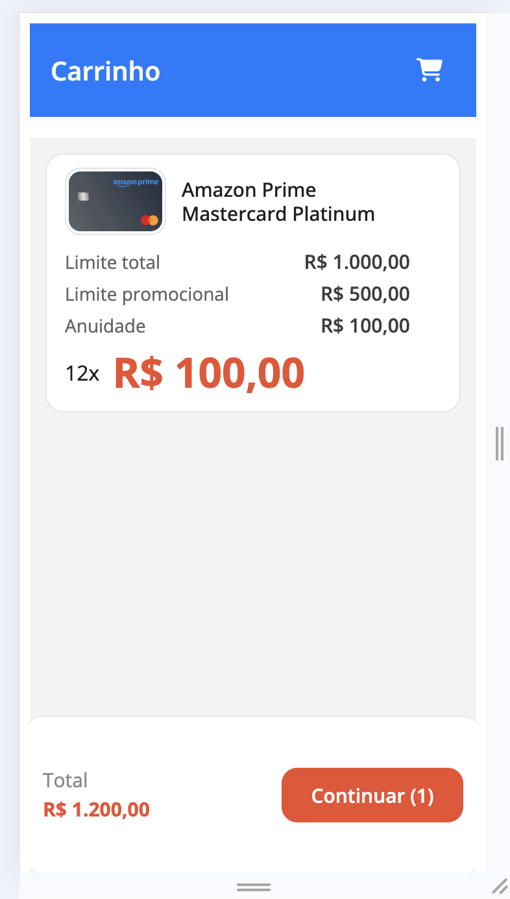

[](https://app.netlify.com/sites/planer-future/deploys)

<h1 align="center">
  Monolito Cartoes
</h1>
<p align="center">
  Aplicacao web de aquisicao de cartoes desenvolvida em Angular, com arquitetura monolitica.
</p>
<p align="center">
   <a href="http://localhost:4200" target="_blank">Demo local</a>.
</p>

<p align="center">
  
  <a href="https://github.com/Alessandra-Nastassja/monolito-cartoes/commits/main">
    
  </a>
  <a href="https://www.linkedin.com/in/alessandra-nastassja/">
    
  </a>
</p>
<p align="center">
  
</p>

# Monolito - Aplicacao de Aquisicao de Cartoes

Repositorio contendo a implementacao de uma aplicacao web desenvolvida em arquitetura monolitica, como parte do Trabalho de Conclusao de Curso (TCC) em Engenharia de Software.

## Objetivo

A aplicacao foi desenvolvida como base para comparacao com uma arquitetura baseada em micro front-ends, permitindo analise de aspectos relacionados a desempenho, escalabilidade e organizacao estrutural.

## Arquitetura

A aplicacao segue o modelo de arquitetura monolitica, estruturada em um unico projeto Angular com organizacao interna baseada em modulos por funcionalidade (feature-based).

**Caracteristicas principais:**

- Aplicacao unica (single application)
- Build e deploy unificados
- Modulos internos organizados por dominio
- Componentes reutilizaveis em camadas compartilhadas
- Alto acoplamento entre as partes da aplicacao

### Organizacao em Camadas

#### **Core** (`src/app/core/`)
Camada responsavel pela logica de negocio e acesso a dados:
- **Models**: Definicoes de interfaces (`Cartao`, `ItemCarrinho`, `LojaCarrinho`)
- **Services**:
  - `ListaCartoes` - Busca e filtro de cartoes disponiveis
  - `CarrinhoState` - Gerenciamento do estado do carrinho (Signals)
- **Data**: Mock database (`db.json`) com dados de cartoes

#### **Features** (`src/app/features/`)
Modulos de funcionalidades especificas:

**Cartoes** (`cartoes/`)
- Listagem de cartoes disponiveis
- Componente `CardCartao` para exibicao individual
- Modal de confirmacao de selecao
- Loading state durante carregamento

**Carrinho** (`carrinho/`)
- Visualizacao de itens selecionados
- Componente `LojaCarrinhoCard` para renderizacao de itens
- Contador de quantidade por item (`+` e `-`)
- Remocao de item por icone de lixeira
- Calculo automatico de totais e quantidade

#### **Shared** (`src/app/shared/`)
Componentes e utilitarios reutilizaveis:
- **Header** - Topo compartilhado com titulo dinamico, badge e voltar
- **Loading** - Componente com animacao de carregamento
- **Modal** - Componente generico para dialogos
- **Quantity Selector** - Controle de quantidade reutilizavel

## Funcionalidades

A aplicacao simula um sistema de aquisicao de cartoes com:

- Listagem de cartoes disponiveis com loading state
- Selecao e adicao de cartoes ao carrinho
- Modal de confirmacao com detalhes do cartao
- Visualizacao do carrinho com itens selecionados
- Ajuste de quantidade por item no carrinho
- Remocao de item por lixeira
- Calculo automatico de total e quantidade
- Formatacao monetaria em BRL com Intl.NumberFormat
- Navegacao entre telas (`home` e `carrinho`)
- Roteamento lazy-loaded
- Tipagem forte com TypeScript
- Componentes standalone (Angular 21)

## Tecnologias Utilizadas

| Tecnologia | Versao | Proposito |
|-----------|--------|----------|
| Angular | 21.2.7 | Framework frontend |
| Angular CLI / DevKit | 21.2.7 | Build e tooling |
| TypeScript | ~6.0.2 | Linguagem de programacao |
| SCSS | - | Pre-processador CSS |
| RxJS | ~7.8 | Programacao reativa |
| Zone.js | ~0.15.1 | Runtime de change detection |
| Node.js | 20+ | Runtime JavaScript |
| npm | 10+ | Gerenciador de pacotes |
| json-server | 1.0.0-beta.15 | Mock de API REST local |
| Karma + Jasmine | 6.4 / 4.5 | Testes unitarios |
| concurrently + kill-port | 9.2.1 / 2.0.1 | Execucao local (frontend + mock) |

## Estrutura do Projeto

```text
monolito-cartoes/
├── src/
│   ├── app/
│   │   ├── app.ts
│   │   ├── app.html
│   │   ├── app.scss
│   │   ├── app.config.ts
│   │   ├── app.routes.ts
│   │   ├── core/
│   │   │   ├── models/
│   │   │   │   └── cartao.model.ts
│   │   │   ├── services/
│   │   │   │   ├── lista-cartoes/
│   │   │   │   └── carrinho-state/
│   │   │   └── data/
│   │   │       └── db.json
│   │   ├── features/
│   │   │   ├── cartoes/
│   │   │   └── carrinho/
│   │   │       └── components/
│   │   │           └── loja-carrinho-card/
│   │   └── shared/
│   │       └── components/
│   │           ├── header/
│   │           ├── loading/
│   │           ├── modal/
│   │           └── quantity-selector/
│   ├── main.ts
│   ├── main.server.ts
│   ├── server.ts
│   └── styles.scss
├── public/
├── angular.json
├── package.json
├── tsconfig.json
├── tsconfig.app.json
├── tsconfig.spec.json
├── package-lock.json
└── README.md
```

## Como Executar o Projeto

### Pre-requisitos

- Node.js 20+
- npm 10+

### Instalacao de Dependencias

```bash
npm install
```

### Desenvolvimento

**Apenas frontend (Angular):**
```bash
npm start
```
Acesse: `http://localhost:4200`

**Frontend + Mock API (recomendado):**
```bash
npm run dev
```
- Frontend: `http://localhost:4200`
- Mock API: `http://localhost:3000`

### Build de Producao

```bash
npm run build
```

Gera a build otimizada em `dist/monolito-cartoes/`

### Testes

Executar testes unitarios:
```bash
npm test
```

## Scripts Disponiveis

| Script | Descricao |
|--------|-----------|
| `npm start` | Sobe servidor de desenvolvimento |
| `npm run dev` | Sobe frontend + json-server |
| `npm run build` | Gera build de producao |
| `npm run watch` | Build em modo observacao |
| `npm test` | Executa testes |

## Roteamento

```typescript
path: 'home'              -> Cartoes (lazy-loaded)
path: 'carrinho'          -> Carrinho vazio
path: 'carrinho/:id'      -> Carrinho com item selecionado
path: ''                  -> Redirect para 'home'
```

## Dados Mock

**API Local (json-server):**
```text
GET /cartoes       - Lista de cartoes disponiveis
GET /cartoes/:id   - Cartao especifico
```

## Padroes Utilizados

- Signals para state management
- Services para separacao de responsabilidades
- Standalone Components
- Lazy Loading
- TypeScript com tipagem forte
- Organizacao por feature

## Telas

### Home - Lista de Cartoes


### Carrinho


## Contexto Academico

Este projeto compoe o estudo comparativo entre abordagens arquiteturais no frontend:

- **Monolito** (este repositorio) - Aplicacao unica
- **Micro Front-ends** (repositorio comparativo) - Multiplas aplicacoes

## Versao

- **Angular**: 21.2.7
- **TypeScript**: 6.0.2
- **Node**: 20+
- **npm**: 10+

## Contribuicao

Este e um projeto academico de TCC. Para duvidas ou sugestoes, consulte a documentacao do projeto.

## Contato

Para informacoes sobre este projeto, entre em contato com o desenvolvedor responsavel pelo TCC.

---

**Ultima atualizacao:** Abril de 2026
